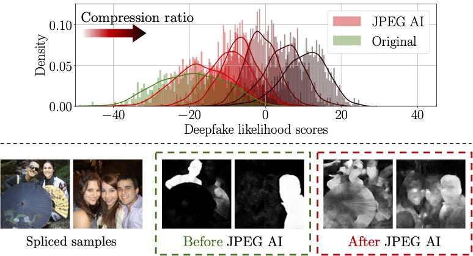

# Is JPEG AI going to change image forensics?



This is the official code repository for the paper *Is JPEG AI going to change image forensics?* currently under revision and available in preprint [here](https://arxiv.org/abs/2412.03261).  
The repository is **under development**, so feel free to open an issue if you encounter any problems.

# Getting started

In order to run our code, you need to:
1. install [conda](https://docs.conda.io/en/latest/miniconda.html)
2. create the `jpeg-ai-antifor` environment using the *environment.yml* file
```bash
conda env create -f envinroment.yml
conda activate jpeg-ai-antifor
```
3. download the [dataset] of the paper and extract it in the *data* folder (data to be uploaded soon!)
4. download the pretrained models for the various detectors and extract them in the corresponding *utils/third_party* folder. Refer to the README.md file in the *utils/third_party* folder for more information.

# Running the code

## Deepfake image detection
The script `test_detector.py` allows to test the performance of the different considered deepfake detectors on the dataset.  
We provide a bash script `test_all.sh` that runs the script for all the detectors.  
Just run:
```bash
bash test_all.sh
```
After computing the results, you can refer to the `notebook` folder and run a single notebook for each detector to visualize the results (i.e., `DetectorName results analysis.ipynb`).
The notebook `Compute paper results.ipynb` allows to compute the results reported in the paper.

## Image splicing localization
The script `test_splicing_detector.py` allows to test the performance of the different considered splicing detectors on the dataset.  
We included the tests for the splicing detectors inside the `test_all.sh` script.  
After computing the results, you can refer to the `notebook` folder and run a single notebook for each detector to visualize the results (i.e., `DetectorName results analysis.ipynb`).

# Remarks
## Hardware requirements
We executed all of our experiments on a workstation equipped with Intel Xeon Gold 6246, 252 GiB of RAM, and 4 Titan RTX (4608 CUDAs @ 1350MHz, 24 GiB).  
**Please note** that depending on the batch size used in the `test_all.sh` script, you might require more memory.

## Data
For our experiments, we relied on the datasets provided by the original authors of the each of the detectors considered.  
We then compressed the images with both JPEG and JPEG AI at different quality factors.  
We refer the user to the `data_compression/README.md` for more information on how to compress the images.

# Credits & acknowledgements
All the detectors considered in this work are publicly available and have been developed by the respective authors.  
We refer to the original papers for more information on the detectors and the respective licenses.  
We would like to thank them nonetheless for making their code available and allowing us to perform our experiments.  
For details on the JPEG AI Reference software, please refer to the [JPEG AI Reference software license](https://gitlab.com/wg1/jpeg-ai/jpeg-ai-reference-software/-/blob/master/LICENSE).
